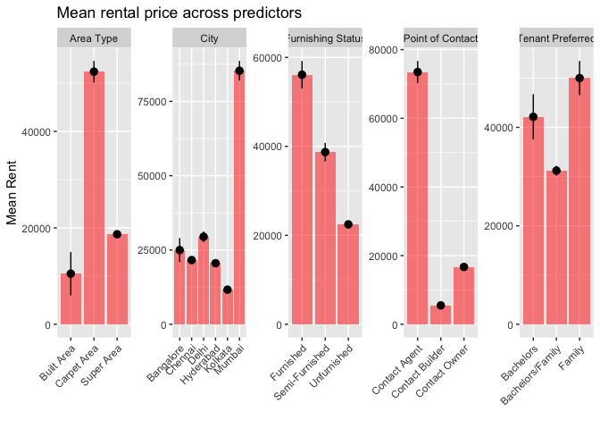

Statistical learning final project
================
Tyler Brown
2025-02-09

## Loading libraries and data

``` r
# loading libraries
library(tidyverse)
```

    ## ── Attaching core tidyverse packages ──────────────────────── tidyverse 2.0.0 ──
    ## ✔ dplyr     1.1.4     ✔ readr     2.1.5
    ## ✔ forcats   1.0.0     ✔ stringr   1.5.1
    ## ✔ ggplot2   3.5.1     ✔ tibble    3.2.1
    ## ✔ lubridate 1.9.3     ✔ tidyr     1.3.1
    ## ✔ purrr     1.0.2     
    ## ── Conflicts ────────────────────────────────────────── tidyverse_conflicts() ──
    ## ✖ dplyr::filter() masks stats::filter()
    ## ✖ dplyr::lag()    masks stats::lag()
    ## ℹ Use the conflicted package (<http://conflicted.r-lib.org/>) to force all conflicts to become errors

``` r
library(haven)
library(fastDummies)
library(torch)
library(glmnet)
```

    ## Loading required package: Matrix
    ## 
    ## Attaching package: 'Matrix'
    ## 
    ## The following objects are masked from 'package:tidyr':
    ## 
    ##     expand, pack, unpack
    ## 
    ## Loaded glmnet 4.1-8

``` r
set.seed(2025)

# loading data
df_raw <- read_csv('1_data/House_Rent_Dataset.csv')
```

    ## Rows: 4746 Columns: 12
    ## ── Column specification ────────────────────────────────────────────────────────
    ## Delimiter: ","
    ## chr  (7): Floor, Area Type, Area Locality, City, Furnishing Status, Tenant P...
    ## dbl  (4): BHK, Rent, Size, Bathroom
    ## date (1): Posted On
    ## 
    ## ℹ Use `spec()` to retrieve the full column specification for this data.
    ## ℹ Specify the column types or set `show_col_types = FALSE` to quiet this message.

``` r
# descriptive plot on rent with numeric predictors
df_raw %>% select_if(is.numeric) %>% 
  pivot_longer(!Rent) %>% 
  ggplot(aes(x = value, y = Rent))+
  geom_point()+
  stat_summary_bin(color = 'red')+
  facet_wrap(~name, scales = 'free')
```

    ## No summary function supplied, defaulting to `mean_se()`
    ## No summary function supplied, defaulting to `mean_se()`
    ## No summary function supplied, defaulting to `mean_se()`

    ## Warning: Removed 1 row containing missing values or values outside the scale range
    ## (`geom_segment()`).

    ## Warning: Removed 4 rows containing missing values or values outside the scale range
    ## (`geom_segment()`).

<!-- -->

``` r
df_raw %>% 
  ggplot(aes(x = `Posted On`, y = log(Rent)))+
  stat_summary_bin()
```

    ## No summary function supplied, defaulting to `mean_se()`

    ## Warning: Removed 1 row containing missing values or values outside the scale range
    ## (`geom_segment()`).

<!-- -->

``` r
df_raw %>% select(where(is.character), Rent) %>% 
  select(!c('Area Locality', 'Floor')) %>% 
  pivot_longer(!Rent) %>% 
  ggplot(aes(x = value, y = Rent))+
  stat_summary_bin(geom = 'bar', fill = 'red', alpha = 0.5)+
  stat_summary_bin()+
  facet_wrap(~name, scales = 'free', nrow = 1)+
  theme(axis.text.x = element_text(angle = 45, vjust = 1, hjust=1))+
  labs(x = '', y = 'Mean Rent', title = 'Mean rental price across predictors')
```

    ## No summary function supplied, defaulting to `mean_se()`
    ## No summary function supplied, defaulting to `mean_se()`
    ## No summary function supplied, defaulting to `mean_se()`
    ## No summary function supplied, defaulting to `mean_se()`
    ## No summary function supplied, defaulting to `mean_se()`
    ## No summary function supplied, defaulting to `mean_se()`
    ## No summary function supplied, defaulting to `mean_se()`
    ## No summary function supplied, defaulting to `mean_se()`
    ## No summary function supplied, defaulting to `mean_se()`
    ## No summary function supplied, defaulting to `mean_se()`
    ## No summary function supplied, defaulting to `mean_se()`
    ## No summary function supplied, defaulting to `mean_se()`
    ## No summary function supplied, defaulting to `mean_se()`
    ## No summary function supplied, defaulting to `mean_se()`
    ## No summary function supplied, defaulting to `mean_se()`
    ## No summary function supplied, defaulting to `mean_se()`
    ## No summary function supplied, defaulting to `mean_se()`
    ## No summary function supplied, defaulting to `mean_se()`
    ## No summary function supplied, defaulting to `mean_se()`
    ## No summary function supplied, defaulting to `mean_se()`
    ## No summary function supplied, defaulting to `mean_se()`
    ## No summary function supplied, defaulting to `mean_se()`
    ## No summary function supplied, defaulting to `mean_se()`
    ## No summary function supplied, defaulting to `mean_se()`
    ## No summary function supplied, defaulting to `mean_se()`
    ## No summary function supplied, defaulting to `mean_se()`
    ## No summary function supplied, defaulting to `mean_se()`
    ## No summary function supplied, defaulting to `mean_se()`
    ## No summary function supplied, defaulting to `mean_se()`
    ## No summary function supplied, defaulting to `mean_se()`
    ## No summary function supplied, defaulting to `mean_se()`
    ## No summary function supplied, defaulting to `mean_se()`
    ## No summary function supplied, defaulting to `mean_se()`
    ## No summary function supplied, defaulting to `mean_se()`
    ## No summary function supplied, defaulting to `mean_se()`
    ## No summary function supplied, defaulting to `mean_se()`

    ## Warning: Removed 1 row containing missing values or values outside the scale range
    ## (`geom_segment()`).

<!-- -->

``` r
# ggsave('2_plots/mean_rental_cat_vars.png')

# justifying the log transformation
df_raw %>% 
  ggplot(aes(x = Rent))+
  geom_density()
```

<!-- -->

``` r
df_raw %>% 
  ggplot(aes(x = log(Rent)))+
  geom_density()
```

<!-- -->

``` r
# checking NAs
df_raw %>% 
  summarise_all(~sum(is.na(.))) %>% 
  t
```

    ##                   [,1]
    ## Posted On            0
    ## BHK                  0
    ## Rent                 0
    ## Size                 0
    ## Floor                0
    ## Area Type            0
    ## Area Locality        0
    ## City                 0
    ## Furnishing Status    0
    ## Tenant Preferred     0
    ## Bathroom             0
    ## Point of Contact     0

## Data preparation

``` r
# scaling numeric attributes
df <- df_raw %>%
  ungroup %>% 
  mutate(Rent = log(Rent)) %>% 
  mutate(`Posted On` = as.numeric(`Posted On`)) %>% 
  mutate_if(is.numeric, scale)


# recoding furnished as binary
df <- df %>% mutate(`Furnishing Status` = case_when(`Furnishing Status` == 'Unfurnished' ~ 0,
                                                    `Furnishing Status` == 'Semi-Furnished' ~ 1,
                                                    `Furnishing Status` == 'Furnished' ~ 1))


# making binary indicators across all categorical attributes
df <- dummy_cols(df, c('Floor', 
                 'Area Type', 
                 'Area Locality',
                 'City',
                 'Tenant Preferred', 
                 'Point of Contact'))

# removing initial categorical variables
df <- df %>% select(-c('Floor', 
                 'Area Type', 
                 'Area Locality', 
                 'City',
                 'Tenant Preferred', 
                 'Point of Contact'))

# renaming target variable for ease of use
df <- df %>% rename(target = Rent)


# constructing train/test split
train_indices <- sample(dim(df)[1], dim(df)[1] * 0.8)

df_train <- df[train_indices, ]
df_test <- df[-train_indices, ]

batch_size <- 32

# making tensor data
train_x <- torch_tensor(df_train %>% select(!target) %>% as.matrix)
train_y <- torch_tensor(df_train %>% select(target) %>% as.matrix)

test_x <- torch_tensor(df_test %>% select(!target) %>% as.matrix)
test_y <- torch_tensor(df_test %>% select(target) %>% as.matrix)

train_dl <- dataloader(tensor_dataset(train_x, train_y), 
                       batch_size = batch_size, 
                       shuffle = T)

test_dl <- dataloader(tensor_dataset(test_x, test_y), 
                      batch_size = batch_size, 
                      shuffle = F)
```

``` r
## ORGANIZING NEURAL NETWORK

# 2735 - 1 features

ModelClass <- nn_module(
  
  # initializing the model structure
  initialize = function() {
    # layer 1
    self$layer1 <- nn_linear(dim(df)[2] - 1, 4000)
    self$dropout1 <- nn_dropout(p = 0.25)
    
    # layer 2
    self$layer2 <- nn_linear(4000, 1000)
    self$dropout2 <- nn_dropout(p = 0.25)
    
    # layer 3
    self$layer3 <- nn_linear(1000, 100)
    self$dropout3 <- nn_dropout(p = 0.25)
    
    # output layer
    self$output <- nn_linear(100, 1)
    
  },
  
  # defining the forward feed function
  forward = function(x) {
    x %>% 
      self$layer1() %>% 
      nnf_relu() %>% 
      self$dropout1() %>% 
      self$layer2() %>% 
      nnf_relu() %>% 
      self$dropout2() %>% 
      self$layer3() %>% 
      nnf_relu() %>% 
      self$dropout3() %>% 
      self$output()
  }
)
```

``` r
# initializing hyperparameters

# also implementing early stopping in the event that the validation error is not improving over time
patience <- 5  


# tuning loop parameters

learning_rates <- c(0.001, 0.01, 0.1)
lambdas <- c(0.000001, 0.00001, 0.0001)

# number of epochs
num_epochs <- 20

# initializing list of models to be saved
model_list <- list()
```

## Training loop

``` r
for (learn_rate in learning_rates){
  for (lambda in lambdas){
    
    # defining model
    model <- ModelClass()
    
    optimizer <- optim_sgd(model$parameters, lr = learn_rate, weight_decay = lambda)
    loss_func <- nnf_mse_loss
    
    mean_train_losses <- c()
    mean_val_losses <- c()

    best_val_loss <- Inf
    counter <- 0
    
    for (epoch in 1:num_epochs) {
      
      model$train()
      train_losses <- c()  
      
      coro::loop(for (b in train_dl) {
        optimizer$zero_grad()
        output <- model(b[[1]])
        loss <- loss_func(output, b[[2]])
        loss$backward()
        optimizer$step()
        train_losses <- c(train_losses, loss$item())
      })
      
      model$eval()
      valid_losses <- c()
      
      coro::loop(for (b in test_dl) {
        output <- model(b[[1]])
        loss <- loss_func(output, b[[2]])
        valid_losses <- c(valid_losses, loss$item())
      })
      
      # pushing errors to the outer list
      mean_train_loss <- mean(train_losses)
      mean_val_loss <- mean(valid_losses)
      
      mean_train_losses <- c(mean_train_losses, mean_train_loss)
      mean_val_losses <- c(mean_val_losses, mean_val_loss)
      
      model_list[[paste(learn_rate, '-', lambda)]] <- list(train_loss = mean_train_losses, val_loss = mean_val_losses)
    
      print(paste('Epoch: ', epoch, 'train loss:', mean_train_loss, 'val loss:', mean_val_loss))      

      # early stopping 
      if (mean_val_loss < best_val_loss) {
        best_val_loss <- mean_val_loss
        k <- 0  
      } else {
        k <- k + 1

        if (counter >= patience) {
          break
        }
      }
    }
  }
}
```

    ## [1] "Epoch:  1 train loss: 1.00117830468827 val loss: 0.974156959851583"
    ## [1] "Epoch:  2 train loss: 0.996577656820041 val loss: 0.970652292172114"
    ## [1] "Epoch:  3 train loss: 0.993562810060357 val loss: 0.96705142557621"
    ## [1] "Epoch:  4 train loss: 0.989230656824192 val loss: 0.963115733861923"
    ## [1] "Epoch:  5 train loss: 0.987470734520119 val loss: 0.958720324436823"
    ## [1] "Epoch:  6 train loss: 0.984795331704516 val loss: 0.953647763530413"
    ## [1] "Epoch:  7 train loss: 0.975696899560319 val loss: 0.947907437880834"
    ## [1] "Epoch:  8 train loss: 0.972134361247055 val loss: 0.94132285118103"
    ## [1] "Epoch:  9 train loss: 0.96320178303398 val loss: 0.933714221914609"
    ## [1] "Epoch:  10 train loss: 0.953953318986572 val loss: 0.924688805143039"
    ## [1] "Epoch:  11 train loss: 0.945037092230901 val loss: 0.914046424627304"
    ## [1] "Epoch:  12 train loss: 0.934086379133353 val loss: 0.90116067926089"
    ## [1] "Epoch:  13 train loss: 0.92009661302847 val loss: 0.885687317450841"
    ## [1] "Epoch:  14 train loss: 0.903741295848574 val loss: 0.867032154401143"
    ## [1] "Epoch:  15 train loss: 0.88296735812636 val loss: 0.844560561577479"
    ## [1] "Epoch:  16 train loss: 0.856729713307709 val loss: 0.81737402677536"
    ## [1] "Epoch:  17 train loss: 0.827820035589843 val loss: 0.784083713094394"
    ## [1] "Epoch:  18 train loss: 0.791074906828023 val loss: 0.743969320257505"
    ## [1] "Epoch:  19 train loss: 0.741351680094455 val loss: 0.695915801326434"
    ## [1] "Epoch:  20 train loss: 0.690782845270734 val loss: 0.640905098120372"
    ## [1] "Epoch:  1 train loss: 1.00619343899879 val loss: 0.978215399384499"
    ## [1] "Epoch:  2 train loss: 1.00230810897691 val loss: 0.972219102581342"
    ## [1] "Epoch:  3 train loss: 0.994203336599494 val loss: 0.966695655385653"
    ## [1] "Epoch:  4 train loss: 0.987827187826653 val loss: 0.961367638905843"
    ## [1] "Epoch:  5 train loss: 0.983269452547827 val loss: 0.955725479125977"
    ## [1] "Epoch:  6 train loss: 0.978732303411019 val loss: 0.949323030312856"
    ## [1] "Epoch:  7 train loss: 0.971461248498003 val loss: 0.942083484927813"
    ## [1] "Epoch:  8 train loss: 0.966321441305786 val loss: 0.934165068467458"
    ## [1] "Epoch:  9 train loss: 0.955729004715671 val loss: 0.9251916517814"
    ## [1] "Epoch:  10 train loss: 0.945836976546199 val loss: 0.91481220126152"
    ## [1] "Epoch:  11 train loss: 0.934700835151833 val loss: 0.90271048049132"
    ## [1] "Epoch:  12 train loss: 0.921954289955251 val loss: 0.888252671559652"
    ## [1] "Epoch:  13 train loss: 0.907426572396976 val loss: 0.871038960417112"
    ## [1] "Epoch:  14 train loss: 0.887918982435675 val loss: 0.850498447815577"
    ## [1] "Epoch:  15 train loss: 0.865630281823022 val loss: 0.825740988055865"
    ## [1] "Epoch:  16 train loss: 0.838107580647749 val loss: 0.795794405539831"
    ## [1] "Epoch:  17 train loss: 0.806517695679384 val loss: 0.759784571329753"
    ## [1] "Epoch:  18 train loss: 0.762441896340426 val loss: 0.71664450665315"
    ## [1] "Epoch:  19 train loss: 0.716673347378979 val loss: 0.666690412163735"
    ## [1] "Epoch:  20 train loss: 0.661195676867701 val loss: 0.610530419150988"
    ## [1] "Epoch:  1 train loss: 1.00123789981634 val loss: 0.975597872336705"
    ## [1] "Epoch:  2 train loss: 1.00089545335088 val loss: 0.972083564599355"
    ## [1] "Epoch:  3 train loss: 0.994735368159639 val loss: 0.969161199529966"
    ## [1] "Epoch:  4 train loss: 0.99179983164082 val loss: 0.966554928819339"
    ## [1] "Epoch:  5 train loss: 0.989741559789962 val loss: 0.964221912622452"
    ## [1] "Epoch:  6 train loss: 0.987498480732701 val loss: 0.962180119752884"
    ## [1] "Epoch:  7 train loss: 0.986943890818027 val loss: 0.9602646758159"
    ## [1] "Epoch:  8 train loss: 0.983847246200097 val loss: 0.958371313412984"
    ## [1] "Epoch:  9 train loss: 0.980469925062997 val loss: 0.956370602051417"
    ## [1] "Epoch:  10 train loss: 0.978939007811186 val loss: 0.954198010762533"
    ## [1] "Epoch:  11 train loss: 0.978481769812207 val loss: 0.951717518766721"
    ## [1] "Epoch:  12 train loss: 0.973520372595106 val loss: 0.949018042286237"
    ## [1] "Epoch:  13 train loss: 0.971405738041181 val loss: 0.945945053299268"
    ## [1] "Epoch:  14 train loss: 0.967316780521088 val loss: 0.942299504081408"
    ## [1] "Epoch:  15 train loss: 0.962813050556584 val loss: 0.938027343153954"
    ## [1] "Epoch:  16 train loss: 0.957132487988272 val loss: 0.933006832997004"
    ## [1] "Epoch:  17 train loss: 0.952037657509331 val loss: 0.926992429296176"
    ## [1] "Epoch:  18 train loss: 0.945123724075926 val loss: 0.920021627346675"
    ## [1] "Epoch:  19 train loss: 0.939577988716735 val loss: 0.912052775422732"
    ## [1] "Epoch:  20 train loss: 0.93000313489377 val loss: 0.902545099457105"
    ## [1] "Epoch:  1 train loss: 0.971596745382838 val loss: 0.889041383067767"
    ## [1] "Epoch:  2 train loss: 0.743275082662326 val loss: 0.462992491324743"
    ## [1] "Epoch:  3 train loss: 0.356509256763619 val loss: 0.272248717149099"
    ## [1] "Epoch:  4 train loss: 0.271235183632674 val loss: 0.230784483005603"
    ## [1] "Epoch:  5 train loss: 0.241368352865972 val loss: 0.20571573227644"
    ## [1] "Epoch:  6 train loss: 0.22226691001854 val loss: 0.19504788890481"
    ## [1] "Epoch:  7 train loss: 0.216109959518208 val loss: 0.190133474767208"
    ## [1] "Epoch:  8 train loss: 0.208376185984171 val loss: 0.18724589496851"
    ## [1] "Epoch:  9 train loss: 0.209556742813908 val loss: 0.183056914558013"
    ## [1] "Epoch:  10 train loss: 0.202174875478284 val loss: 0.181842247396708"
    ## [1] "Epoch:  11 train loss: 0.200474239760587 val loss: 0.180919221043587"
    ## [1] "Epoch:  12 train loss: 0.197180404069544 val loss: 0.178505754967531"
    ## [1] "Epoch:  13 train loss: 0.198101218695901 val loss: 0.179019578794638"
    ## [1] "Epoch:  14 train loss: 0.187671189360759 val loss: 0.179569635291894"
    ## [1] "Epoch:  15 train loss: 0.192046588083275 val loss: 0.175486567864815"
    ## [1] "Epoch:  16 train loss: 0.186722277405382 val loss: 0.174393709252278"
    ## [1] "Epoch:  17 train loss: 0.187374319161187 val loss: 0.173216334482034"
    ## [1] "Epoch:  18 train loss: 0.186974932791806 val loss: 0.172351123144229"
    ## [1] "Epoch:  19 train loss: 0.18403556742588 val loss: 0.171622976164023"
    ## [1] "Epoch:  20 train loss: 0.182217077829507 val loss: 0.170750672618548"
    ## [1] "Epoch:  1 train loss: 0.979718892514205 val loss: 0.913759805758794"
    ## [1] "Epoch:  2 train loss: 0.845056885931672 val loss: 0.649903773764769"
    ## [1] "Epoch:  3 train loss: 0.452745919092363 val loss: 0.299821190784375"
    ## [1] "Epoch:  4 train loss: 0.291919018040184 val loss: 0.243558558821678"
    ## [1] "Epoch:  5 train loss: 0.250081776821313 val loss: 0.212965064247449"
    ## [1] "Epoch:  6 train loss: 0.232732263996321 val loss: 0.203540001561244"
    ## [1] "Epoch:  7 train loss: 0.221314341205509 val loss: 0.193112091223399"
    ## [1] "Epoch:  8 train loss: 0.217657593681532 val loss: 0.18744658579429"
    ## [1] "Epoch:  9 train loss: 0.209983191820754 val loss: 0.186495673159758"
    ## [1] "Epoch:  10 train loss: 0.209648350331964 val loss: 0.182792431861162"
    ## [1] "Epoch:  11 train loss: 0.209002555293195 val loss: 0.182767779380083"
    ## [1] "Epoch:  12 train loss: 0.205161793204416 val loss: 0.182991180568933"
    ## [1] "Epoch:  13 train loss: 0.196531116868518 val loss: 0.180607537676891"
    ## [1] "Epoch:  14 train loss: 0.202535886286187 val loss: 0.180802873522043"
    ## [1] "Epoch:  15 train loss: 0.193530343347738 val loss: 0.181937854488691"
    ## [1] "Epoch:  16 train loss: 0.194627843985037 val loss: 0.178353534142176"
    ## [1] "Epoch:  17 train loss: 0.191203770079032 val loss: 0.17406133984526"
    ## [1] "Epoch:  18 train loss: 0.184099152809432 val loss: 0.173012292136749"
    ## [1] "Epoch:  19 train loss: 0.185044931013043 val loss: 0.172792534033457"
    ## [1] "Epoch:  20 train loss: 0.186385527002711 val loss: 0.174293843160073"
    ## [1] "Epoch:  1 train loss: 0.994953061853136 val loss: 0.963771375020345"
    ## [1] "Epoch:  2 train loss: 0.981177662100111 val loss: 0.944237675269445"
    ## [1] "Epoch:  3 train loss: 0.935440535555367 val loss: 0.858554126818975"
    ## [1] "Epoch:  4 train loss: 0.728271450064763 val loss: 0.48514818350474"
    ## [1] "Epoch:  5 train loss: 0.381799739073305 val loss: 0.29712719420592"
    ## [1] "Epoch:  6 train loss: 0.314476202390775 val loss: 0.251549691706896"
    ## [1] "Epoch:  7 train loss: 0.26826588189652 val loss: 0.225636508812507"
    ## [1] "Epoch:  8 train loss: 0.253056835164042 val loss: 0.210120355834564"
    ## [1] "Epoch:  9 train loss: 0.242719696286847 val loss: 0.204988227784634"
    ## [1] "Epoch:  10 train loss: 0.241209338442618 val loss: 0.200547643999259"
    ## [1] "Epoch:  11 train loss: 0.223735223485141 val loss: 0.195322943478823"
    ## [1] "Epoch:  12 train loss: 0.224862408550347 val loss: 0.19240396892031"
    ## [1] "Epoch:  13 train loss: 0.228337921765672 val loss: 0.190591284135977"
    ## [1] "Epoch:  14 train loss: 0.214247733980668 val loss: 0.188244524349769"
    ## [1] "Epoch:  15 train loss: 0.214911478845512 val loss: 0.190457254648209"
    ## [1] "Epoch:  16 train loss: 0.220501821456837 val loss: 0.18670449629426"
    ## [1] "Epoch:  17 train loss: 0.208935083398799 val loss: 0.183880285918713"
    ## [1] "Epoch:  18 train loss: 0.21015716412989 val loss: 0.183626393973827"
    ## [1] "Epoch:  19 train loss: 0.201684619573986 val loss: 0.187590817610423"
    ## [1] "Epoch:  20 train loss: 0.200671831912854 val loss: 0.184154867132505"
    ## [1] "Epoch:  1 train loss: 0.425940955574272 val loss: 0.34807884345452"
    ## [1] "Epoch:  2 train loss: 0.232847967192906 val loss: 0.199923381706079"
    ## [1] "Epoch:  3 train loss: 0.210305300517743 val loss: 0.228719749550025"
    ## [1] "Epoch:  4 train loss: 0.196059024258822 val loss: 0.191954482346773"
    ## [1] "Epoch:  5 train loss: 0.191135131824417 val loss: 0.218425787861149"
    ## [1] "Epoch:  6 train loss: 0.181970134972274 val loss: 0.238010859737794"
    ## [1] "Epoch:  7 train loss: 0.186382071498562 val loss: 0.189278625696898"
    ## [1] "Epoch:  8 train loss: 0.177014303745843 val loss: 0.230516762286425"
    ## [1] "Epoch:  9 train loss: 0.166472931525537 val loss: 0.197427650292714"
    ## [1] "Epoch:  10 train loss: 0.159507250272426 val loss: 0.161648437629143"
    ## [1] "Epoch:  11 train loss: 0.158908808243876 val loss: 0.159742958347003"
    ## [1] "Epoch:  12 train loss: 0.148562386882405 val loss: 0.168084243188302"
    ## [1] "Epoch:  13 train loss: 0.160484921343687 val loss: 0.190601320316394"
    ## [1] "Epoch:  14 train loss: 0.149529024301206 val loss: 0.161434085915486"
    ## [1] "Epoch:  15 train loss: 0.139751380825994 val loss: 0.173495583732923"
    ## [1] "Epoch:  16 train loss: 0.138074389964092 val loss: 0.159776080648104"
    ## [1] "Epoch:  17 train loss: 0.129875825013684 val loss: 0.162675801664591"
    ## [1] "Epoch:  18 train loss: 0.133314549766418 val loss: 0.155651008834441"
    ## [1] "Epoch:  19 train loss: 0.122442193078895 val loss: 0.166073374201854"
    ## [1] "Epoch:  20 train loss: 0.131747202619034 val loss: 0.161588230977456"
    ## [1] "Epoch:  1 train loss: 0.475628042671861 val loss: 0.257450111458699"
    ## [1] "Epoch:  2 train loss: 0.233732495613459 val loss: 0.199643709758917"
    ## [1] "Epoch:  3 train loss: 0.204947056389656 val loss: 0.188388491049409"
    ## [1] "Epoch:  4 train loss: 0.196808981513526 val loss: 0.193068365007639"
    ## [1] "Epoch:  5 train loss: 0.196025335613419 val loss: 0.173271709680557"
    ## [1] "Epoch:  6 train loss: 0.184836015293077 val loss: 0.174585663030545"
    ## [1] "Epoch:  7 train loss: 0.178922632850018 val loss: 0.189988463371992"
    ## [1] "Epoch:  8 train loss: 0.169385818060206 val loss: 0.178727218012015"
    ## [1] "Epoch:  9 train loss: 0.174328017729421 val loss: 0.168727892885605"
    ## [1] "Epoch:  10 train loss: 0.161110792340351 val loss: 0.181328451136748"
    ## [1] "Epoch:  11 train loss: 0.154407879384626 val loss: 0.182128203163544"
    ## [1] "Epoch:  12 train loss: 0.153920362351321 val loss: 0.172165917853514"
    ## [1] "Epoch:  13 train loss: 0.150533885201987 val loss: 0.174202897151311"
    ## [1] "Epoch:  14 train loss: 0.148569977302261 val loss: 0.214620980123679"
    ## [1] "Epoch:  15 train loss: 0.137227180155636 val loss: 0.174374495943387"
    ## [1] "Epoch:  16 train loss: 0.144994024656901 val loss: 0.166384398192167"
    ## [1] "Epoch:  17 train loss: 0.138877008235505 val loss: 0.162234561393658"
    ## [1] "Epoch:  18 train loss: 0.127125736232064 val loss: 0.163429968804121"
    ## [1] "Epoch:  19 train loss: 0.115623224777083 val loss: 0.240140750010808"
    ## [1] "Epoch:  20 train loss: 0.12257970603449 val loss: 0.157678949584564"
    ## [1] "Epoch:  1 train loss: 0.563594498554198 val loss: 0.247506884485483"
    ## [1] "Epoch:  2 train loss: 0.264549542688021 val loss: 0.217676667869091"
    ## [1] "Epoch:  3 train loss: 0.229533709773496 val loss: 0.193300228069226"
    ## [1] "Epoch:  4 train loss: 0.221175956813728 val loss: 0.214715078969796"
    ## [1] "Epoch:  5 train loss: 0.211919418403081 val loss: 0.195771619677544"
    ## [1] "Epoch:  6 train loss: 0.205275311627809 val loss: 0.200524734705687"
    ## [1] "Epoch:  7 train loss: 0.194334080427134 val loss: 0.182457628349463"
    ## [1] "Epoch:  8 train loss: 0.198697508539723 val loss: 0.200906486809254"
    ## [1] "Epoch:  9 train loss: 0.181876029662725 val loss: 0.183197190612555"
    ## [1] "Epoch:  10 train loss: 0.209449169202512 val loss: 0.17401245161891"
    ## [1] "Epoch:  11 train loss: 0.187456283874872 val loss: 0.179734776169062"
    ## [1] "Epoch:  12 train loss: 0.17312933060051 val loss: 0.18851931989193"
    ## [1] "Epoch:  13 train loss: 0.167617330781552 val loss: 0.178620228419701"
    ## [1] "Epoch:  14 train loss: 0.171331315387447 val loss: 0.173272446294626"
    ## [1] "Epoch:  15 train loss: 0.17318035048597 val loss: 0.226205838968356"
    ## [1] "Epoch:  16 train loss: 0.170768154018066 val loss: 0.241628524661064"
    ## [1] "Epoch:  17 train loss: 0.155722916689741 val loss: 0.187301082660755"
    ## [1] "Epoch:  18 train loss: 0.15513284210147 val loss: 0.217297777285178"
    ## [1] "Epoch:  19 train loss: 0.162698974410275 val loss: 0.178047686566909"
    ## [1] "Epoch:  20 train loss: 0.150964421384475 val loss: 0.190328672031562"

## Plotting learning curves

``` r
model_list
```

    ## $`0.001 - 1e-06`
    ## $`0.001 - 1e-06`$train_loss
    ##  [1] 1.0011783 0.9965777 0.9935628 0.9892307 0.9874707 0.9847953 0.9756969
    ##  [8] 0.9721344 0.9632018 0.9539533 0.9450371 0.9340864 0.9200966 0.9037413
    ## [15] 0.8829674 0.8567297 0.8278200 0.7910749 0.7413517 0.6907828
    ## 
    ## $`0.001 - 1e-06`$val_loss
    ##  [1] 0.9741570 0.9706523 0.9670514 0.9631157 0.9587203 0.9536478 0.9479074
    ##  [8] 0.9413229 0.9337142 0.9246888 0.9140464 0.9011607 0.8856873 0.8670322
    ## [15] 0.8445606 0.8173740 0.7840837 0.7439693 0.6959158 0.6409051
    ## 
    ## 
    ## $`0.001 - 1e-05`
    ## $`0.001 - 1e-05`$train_loss
    ##  [1] 1.0061934 1.0023081 0.9942033 0.9878272 0.9832695 0.9787323 0.9714612
    ##  [8] 0.9663214 0.9557290 0.9458370 0.9347008 0.9219543 0.9074266 0.8879190
    ## [15] 0.8656303 0.8381076 0.8065177 0.7624419 0.7166733 0.6611957
    ## 
    ## $`0.001 - 1e-05`$val_loss
    ##  [1] 0.9782154 0.9722191 0.9666957 0.9613676 0.9557255 0.9493230 0.9420835
    ##  [8] 0.9341651 0.9251917 0.9148122 0.9027105 0.8882527 0.8710390 0.8504984
    ## [15] 0.8257410 0.7957944 0.7597846 0.7166445 0.6666904 0.6105304
    ## 
    ## 
    ## $`0.001 - 1e-04`
    ## $`0.001 - 1e-04`$train_loss
    ##  [1] 1.0012379 1.0008955 0.9947354 0.9917998 0.9897416 0.9874985 0.9869439
    ##  [8] 0.9838472 0.9804699 0.9789390 0.9784818 0.9735204 0.9714057 0.9673168
    ## [15] 0.9628131 0.9571325 0.9520377 0.9451237 0.9395780 0.9300031
    ## 
    ## $`0.001 - 1e-04`$val_loss
    ##  [1] 0.9755979 0.9720836 0.9691612 0.9665549 0.9642219 0.9621801 0.9602647
    ##  [8] 0.9583713 0.9563706 0.9541980 0.9517175 0.9490180 0.9459451 0.9422995
    ## [15] 0.9380273 0.9330068 0.9269924 0.9200216 0.9120528 0.9025451
    ## 
    ## 
    ## $`0.01 - 1e-06`
    ## $`0.01 - 1e-06`$train_loss
    ##  [1] 0.9715967 0.7432751 0.3565093 0.2712352 0.2413684 0.2222669 0.2161100
    ##  [8] 0.2083762 0.2095567 0.2021749 0.2004742 0.1971804 0.1981012 0.1876712
    ## [15] 0.1920466 0.1867223 0.1873743 0.1869749 0.1840356 0.1822171
    ## 
    ## $`0.01 - 1e-06`$val_loss
    ##  [1] 0.8890414 0.4629925 0.2722487 0.2307845 0.2057157 0.1950479 0.1901335
    ##  [8] 0.1872459 0.1830569 0.1818422 0.1809192 0.1785058 0.1790196 0.1795696
    ## [15] 0.1754866 0.1743937 0.1732163 0.1723511 0.1716230 0.1707507
    ## 
    ## 
    ## $`0.01 - 1e-05`
    ## $`0.01 - 1e-05`$train_loss
    ##  [1] 0.9797189 0.8450569 0.4527459 0.2919190 0.2500818 0.2327323 0.2213143
    ##  [8] 0.2176576 0.2099832 0.2096484 0.2090026 0.2051618 0.1965311 0.2025359
    ## [15] 0.1935303 0.1946278 0.1912038 0.1840992 0.1850449 0.1863855
    ## 
    ## $`0.01 - 1e-05`$val_loss
    ##  [1] 0.9137598 0.6499038 0.2998212 0.2435586 0.2129651 0.2035400 0.1931121
    ##  [8] 0.1874466 0.1864957 0.1827924 0.1827678 0.1829912 0.1806075 0.1808029
    ## [15] 0.1819379 0.1783535 0.1740613 0.1730123 0.1727925 0.1742938
    ## 
    ## 
    ## $`0.01 - 1e-04`
    ## $`0.01 - 1e-04`$train_loss
    ##  [1] 0.9949531 0.9811777 0.9354405 0.7282715 0.3817997 0.3144762 0.2682659
    ##  [8] 0.2530568 0.2427197 0.2412093 0.2237352 0.2248624 0.2283379 0.2142477
    ## [15] 0.2149115 0.2205018 0.2089351 0.2101572 0.2016846 0.2006718
    ## 
    ## $`0.01 - 1e-04`$val_loss
    ##  [1] 0.9637714 0.9442377 0.8585541 0.4851482 0.2971272 0.2515497 0.2256365
    ##  [8] 0.2101204 0.2049882 0.2005476 0.1953229 0.1924040 0.1905913 0.1882445
    ## [15] 0.1904573 0.1867045 0.1838803 0.1836264 0.1875908 0.1841549
    ## 
    ## 
    ## $`0.1 - 1e-06`
    ## $`0.1 - 1e-06`$train_loss
    ##  [1] 0.4259410 0.2328480 0.2103053 0.1960590 0.1911351 0.1819701 0.1863821
    ##  [8] 0.1770143 0.1664729 0.1595073 0.1589088 0.1485624 0.1604849 0.1495290
    ## [15] 0.1397514 0.1380744 0.1298758 0.1333145 0.1224422 0.1317472
    ## 
    ## $`0.1 - 1e-06`$val_loss
    ##  [1] 0.3480788 0.1999234 0.2287197 0.1919545 0.2184258 0.2380109 0.1892786
    ##  [8] 0.2305168 0.1974277 0.1616484 0.1597430 0.1680842 0.1906013 0.1614341
    ## [15] 0.1734956 0.1597761 0.1626758 0.1556510 0.1660734 0.1615882
    ## 
    ## 
    ## $`0.1 - 1e-05`
    ## $`0.1 - 1e-05`$train_loss
    ##  [1] 0.4756280 0.2337325 0.2049471 0.1968090 0.1960253 0.1848360 0.1789226
    ##  [8] 0.1693858 0.1743280 0.1611108 0.1544079 0.1539204 0.1505339 0.1485700
    ## [15] 0.1372272 0.1449940 0.1388770 0.1271257 0.1156232 0.1225797
    ## 
    ## $`0.1 - 1e-05`$val_loss
    ##  [1] 0.2574501 0.1996437 0.1883885 0.1930684 0.1732717 0.1745857 0.1899885
    ##  [8] 0.1787272 0.1687279 0.1813285 0.1821282 0.1721659 0.1742029 0.2146210
    ## [15] 0.1743745 0.1663844 0.1622346 0.1634300 0.2401408 0.1576789
    ## 
    ## 
    ## $`0.1 - 1e-04`
    ## $`0.1 - 1e-04`$train_loss
    ##  [1] 0.5635945 0.2645495 0.2295337 0.2211760 0.2119194 0.2052753 0.1943341
    ##  [8] 0.1986975 0.1818760 0.2094492 0.1874563 0.1731293 0.1676173 0.1713313
    ## [15] 0.1731804 0.1707682 0.1557229 0.1551328 0.1626990 0.1509644
    ## 
    ## $`0.1 - 1e-04`$val_loss
    ##  [1] 0.2475069 0.2176767 0.1933002 0.2147151 0.1957716 0.2005247 0.1824576
    ##  [8] 0.2009065 0.1831972 0.1740125 0.1797348 0.1885193 0.1786202 0.1732724
    ## [15] 0.2262058 0.2416285 0.1873011 0.2172978 0.1780477 0.1903287

``` r
# looking at loss by model
as.data.frame(do.call(rbind, model_list)) %>% 
  cbind(params = names(model_list)) %>%
  cbind(max_epochs = sapply(model_list, function(x) length(x$`val_loss`))) %>% 
  group_by(params) %>%
  mutate(epoch = list(1:max_epochs)) %>% 
  unnest %>% 
  filter(epoch == max_epochs) %>% 
  arrange(val_loss) %>% 
  ungroup %>% 
  slice(1:3)
```

    ## Warning: `cols` is now required when using `unnest()`.
    ## ℹ Please use `cols = c(train_loss, val_loss, epoch)`.

    ## # A tibble: 3 × 5
    ##   train_loss val_loss params       max_epochs epoch
    ##        <dbl>    <dbl> <chr>             <int> <int>
    ## 1      0.123    0.158 0.1 - 1e-05          20    20
    ## 2      0.132    0.162 0.1 - 1e-06          20    20
    ## 3      0.182    0.171 0.01 - 1e-06         20    20

``` r
# making learning curves plot
as.data.frame(do.call(rbind, model_list)) %>% 
  cbind(params = names(model_list)) %>%
  cbind(max_epochs = sapply(model_list, function(x) length(x$`val_loss`))) %>% 
  group_by(params) %>%
  mutate(epoch = list(1:max_epochs)) %>% 
  unnest %>% 
  select(!max_epochs) %>% 
  pivot_longer(!c(epoch, params)) %>% 
  separate_wider_delim(params, delim = ' - ', names = c('lr', 'lambda')) %>% 
  ggplot(aes(x = epoch, y = value, color = name))+
    geom_line()+
  facet_wrap(~paste0('LR: ', lr, ' Lambda: ', lambda), nrow = 3) +
  labs(color = 'Data split', y = 'MSE loss')+
  ggtitle('Learning curves across hyperparameters')+
  theme_minimal()
```

    ## Warning: `cols` is now required when using `unnest()`.
    ## ℹ Please use `cols = c(train_loss, val_loss, epoch)`.

<!-- -->

``` r
# ggsave('2_plots/learning_curves.png')
```

## Final model training

``` r
## final model
# LR = 0.01, lambda = 0.00001

# defining model

set.seed(2025)
final_model <- ModelClass()

optimizer <- optim_sgd(final_model$parameters, lr = 0.01, weight_decay = 0.00001)
loss_func <- nnf_mse_loss

mean_train_losses <- c()
mean_val_losses <- c()


for (epoch in 1:20) {
  
  final_model$train()
  train_losses <- c()  
  
  coro::loop(for (b in train_dl) {
    optimizer$zero_grad()
    output <- final_model(b[[1]])
    loss <- loss_func(output, b[[2]])
    loss$backward()
    optimizer$step()
    train_losses <- c(train_losses, loss$item())
  })
  
  final_model$eval()
  valid_losses <- c()
  
  coro::loop(for (b in test_dl) {
    output <- final_model(b[[1]])
    loss <- loss_func(output, b[[2]])
    valid_losses <- c(valid_losses, loss$item())
  })
  
  mean_train_loss <- mean(train_losses)
  mean_val_loss <- mean(valid_losses)
  
  mean_train_losses <- c(mean_train_losses, mean_train_loss)
  mean_val_losses <- c(mean_val_losses, mean_val_loss)
  
  print(paste('Epoch: ', epoch, 'train loss:', mean_train_loss, 'val loss:', mean_val_loss))      
  
}
```

    ## [1] "Epoch:  1 train loss: 0.983169666608843 val loss: 0.92314891119798"
    ## [1] "Epoch:  2 train loss: 0.843670948212888 val loss: 0.63170503526926"
    ## [1] "Epoch:  3 train loss: 0.434478228833495 val loss: 0.305758685121934"
    ## [1] "Epoch:  4 train loss: 0.298235377281153 val loss: 0.242468226452668"
    ## [1] "Epoch:  5 train loss: 0.253095454152893 val loss: 0.21473888879021"
    ## [1] "Epoch:  6 train loss: 0.230827444553876 val loss: 0.199621327469746"
    ## [1] "Epoch:  7 train loss: 0.22170795838372 val loss: 0.19314953883489"
    ## [1] "Epoch:  8 train loss: 0.220988115593165 val loss: 0.188348446538051"
    ## [1] "Epoch:  9 train loss: 0.212361868063943 val loss: 0.18639855136474"
    ## [1] "Epoch:  10 train loss: 0.207734022446039 val loss: 0.184134766211112"
    ## [1] "Epoch:  11 train loss: 0.201304243642743 val loss: 0.182468576480945"
    ## [1] "Epoch:  12 train loss: 0.200529484187855 val loss: 0.181662493695815"
    ## [1] "Epoch:  13 train loss: 0.198654692213074 val loss: 0.183527700851361"
    ## [1] "Epoch:  14 train loss: 0.199191415009378 val loss: 0.180578066656987"
    ## [1] "Epoch:  15 train loss: 0.194166231493489 val loss: 0.185303301115831"
    ## [1] "Epoch:  16 train loss: 0.191316311662438 val loss: 0.176109513888756"
    ## [1] "Epoch:  17 train loss: 0.188354260092523 val loss: 0.175326178222895"
    ## [1] "Epoch:  18 train loss: 0.19012589834067 val loss: 0.175645420203606"
    ## [1] "Epoch:  19 train loss: 0.189579980526151 val loss: 0.173358443131049"
    ## [1] "Epoch:  20 train loss: 0.185761885357504 val loss: 0.172715105116367"

# Generating predictions and model comparison

``` r
# getting model preds on test and training data
with_no_grad(
  preds <- final_model(test_x)
)

with_no_grad(
  preds_training <- final_model(train_x)
)

model_predictions_on_test <- cbind(real = as.numeric(test_y), preds = as.numeric(preds)) %>% as.data.frame
model_preds_on_training <- cbind(real = as.numeric(train_y), preds = as.numeric(preds_training)) %>% as.data.frame


## alternative regression approach
# this is supervised learning with continuous output, so regression is our naive approach:

# training linear model
linear_model <- lm(target ~ ., data = df_train)

# getting preds on linear model for test and train
linear_preds <- predict(linear_model, df_test)
```

    ## Warning in predict.lm(linear_model, df_test): prediction from rank-deficient
    ## fit; attr(*, "non-estim") has doubtful cases

``` r
linear_preds_train <- predict(linear_model, df_train)


# ridge regression parameter grid
ridge_params <- c(0.01, 0.001, 0.0001, 0.00001)

# running ridge regression
ridge_regression <- glmnet(df_train %>% select(!target), df_train$target, alpha = 0, lambda = ridge_params)

# getting ridge regression predictions
preds_ridge <- predict(ridge_regression, s = 0.2, newx = df_test %>% select(!target) %>% as.matrix)

ridge_MSE <- list()
ridge_MAE <- list()

#looping through to get test errors
for (param in ridge_params){
  
  preds_ridge <- predict(ridge_regression, s = param, newx = df_test %>% select(!target) %>% as.matrix)
  
  MSE <- mean((as.numeric(preds_ridge) - as.numeric(df_test$target))**2)
  MAE <- mean(abs(preds_ridge - df_test$target))
  ridge_MSE[[paste(param)]] <- MSE
  ridge_MAE[[paste(param)]] <- MAE
}

# summarising models
do.call(rbind, ridge_MSE) %>% 
  cbind(names(ridge_MSE)) %>% 
  as.data.frame() %>% 
  rename(MSE = V1, lambda = V2) %>% 
  mutate_all(as.numeric) %>% 
  arrange(MSE)
```

    ##             MSE lambda
    ## 0.01  0.2045597  1e-02
    ## 0.001 0.2103730  1e-03
    ## 1e-04 0.2192737  1e-04
    ## 1e-05 0.2217403  1e-05

``` r
do.call(rbind, ridge_MAE) %>% 
  cbind(names(ridge_MAE)) %>% 
  as.data.frame() %>% 
  rename(MSE = V1, lambda = V2) %>% 
  mutate_all(as.numeric) %>% 
  arrange(MSE)
```

    ##             MSE lambda
    ## 0.01  0.3274631  1e-02
    ## 0.001 0.3325921  1e-03
    ## 1e-04 0.3400635  1e-04
    ## 1e-05 0.3420642  1e-05

## Model diagnostics on test data

``` r
# DNN on test
model_predictions_on_test %>%
  summarise(MSE = mean((real - preds)**2),
            MAE = mean(abs(real - preds)),
            )
```

    ##         MSE       MAE
    ## 1 0.1731631 0.3101418

``` r
# DNN on train
model_preds_on_training %>%
  summarise(MSE = mean((real - preds)**2),
            MAE = mean(abs(real - preds)),
            )
```

    ##         MSE      MAE
    ## 1 0.1600517 0.293037

``` r
# OLS on test
cbind(real = df_test$target, 
      preds = linear_preds) %>% 
  as.data.frame %>% 
  summarise(MSE = mean((real - preds)**2),
            MAE = mean(abs(real - preds)),
  )
```

    ##         MSE       MAE
    ## 1 0.6406486 0.5390021

``` r
# OLS on train
cbind(real = df_train$target, 
      preds = linear_preds_train) %>% 
  as.data.frame %>% 
  summarise(MSE = mean((real - preds)**2),
            MAE = mean(abs(real - preds)),
  )
```

    ##          MSE       MAE
    ## 1 0.03781795 0.1120334

``` r
# making residuals plot
preds_comp_df <- model_predictions_on_test %>% mutate(model = 'DNN') %>% 
  rbind(cbind(real = df_test$target, preds = linear_preds, model = 'OLS'))

preds_comp_df %>% 
  mutate(real = as.numeric(real),
         preds = as.numeric(preds)) %>%
  ggplot(aes(x = preds, y = real-preds, color = model))+
  geom_point(size = 2, pch = 1)+
  scale_color_manual(values = c('steelblue', 'darkorange'))+
  labs(x = 'Predicted value', y = 'Residual', color = 'Model', title = 'Predicted values vs. residuals')+
  theme_minimal()
```

<!-- -->

``` r
# ggsave('2_plots/preds_resids.png')
```
